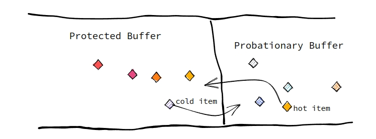

## ShaunDB kLRUCache 实现

ShaunDB 的kLRUCache 实现在 [ShaunDB/src/util/klrucache](../src/util/klrucache.hpp).

KLRUCache 主要是给 db 部分的 MemTaskWorker 所使用, 也采用了 Per MemTaskWorker one klrucache.

Shaundb::klrucache 的实现基于该论文[双队列缓冲区的管理算法](https://www.semanticscholar.org/paper/2Q%3A-A-Low-Overhead-High-Performance-Buffer-Johnson-Shasha/5fa357b43c8351a5d8e7124429e538ad7d687abc) 的思想.
 论文中提到了传统的lrucache 不能有效的解决 "当读一次过大的冷数据, 会导致其他的热数据会被淘汰该问题", 为了解决该问题采用了两个队列来进行淘汰策略. (此处的冷热是相对于 lrucache 内部).


论文的思想大致如下:
- 采用冷热两个队列进行数据的放置, 两个队列拥有不同的内存占用比, 冷热的内存占比默认是 1 : 9.
- 当一个 kv 被```set```时, 先放入冷队列中, 只有当该数据被重新```get```时, 我们认为他可能是一个热数据, 所以此处不需要将他放在冷数据队列头部, 而是添加到热数据队列头部, 进行慢淘汰.
- 同时, 当热数据队列到达阈值时, 对热数据的淘汰都将会是将```push```到冷队列头部, 所以所有的数据淘汰都将由冷数据淘汰出去. 热数据将会占有整个 cache 空间.
- 如果是在热数据队列中```get```到该kv, 则将其放入到热数据队列的头部.

我的实现及思考:
- 我完全实现了论文中所提及的冷热双队列的lrucache, 但是个人感觉 1 : 9 还是有点太过于极端, 所以 shaundb::klrucache 的默认配置是 1 : 4, 事实上, 这样做其实并不能让 插入更快或者读取速度更快, 相反由于过多的条件判断还会略微降低性能, 但是他所带来的这种 cache 友好, 能让 热数据更加持久, 让冷数据更快速的被 pop 出去, 我认为是值得的.